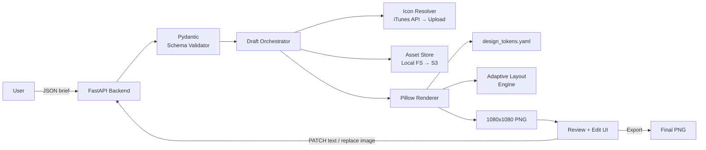

# Market Radar Forge — Automated Post Generator

> Working name: `market-radar-forge` (rename in Phase 1 if you prefer `nbg-post-forge`, `puzzle-radar-forge`, etc.)

A Python service that takes a JSON brief — main game name, publisher, and 2–4 inspirations — and produces a pixel-perfect 1080×1080 Instagram/LinkedIn post matching the NextBigGames "Market Radar" design. Includes a lightweight web UI to review the draft and fix wrong names, wrong publishers, or wrong images before export.

---

## 1. Objectives (from brief)

| # | Objective | How the plan addresses it |
|---|-----------|---------------------------|
| 1 | Accept JSON input with main game + nested inspirations array (2/3/4) that the creative adapts to | Pydantic-validated schema + adaptive layout engine that computes row height and icon size from `len(inspirations)` |
| 2 | Output is 1080×1080, uses user-defined colors and fonts | Single `design_tokens.yaml` config file holds all colors, fonts, spacing, radii. The renderer reads only from this config — zero hardcoded style values |
| 3 | User can fix wrong game name, publisher, or images after generating a draft | FastAPI backend stores drafts by ID; edit endpoints let user PATCH text fields and replace images. Every edit re-renders and returns a new preview |

---

## 2. High-Level Architecture



### Components

- **FastAPI Backend** — HTTP surface: create draft, get draft, patch fields, replace image, export.
- **Pydantic Schema Validator** — Rejects malformed input early with clear errors.
- **Draft Orchestrator** — Manages the draft lifecycle: resolve icons → store assets → render → persist.
- **Icon Resolver** — Hybrid strategy: iTunes Search API first, manual upload fallback.
- **Asset Store** — Abstraction layer (interface + local FS implementation) designed for drop-in S3 replacement.
- **Pillow Renderer** — Pure-Python image composition. Component-based (header, title block, inspiration column, phone mockup).
- **Adaptive Layout Engine** — Computes row heights, icon sizes, font sizes based on inspiration count.
- **Design Tokens** — Single source of truth for colors, fonts, spacing, radii. YAML-configured.
- **Web UI** — Minimal Jinja2 + HTMX pages. One page: form on the left, live preview on the right.

---

## 3. Tech Stack & Rationale

| Layer | Choice | Why |
|-------|--------|-----|
| Language | Python 3.11+ | Matches your Data Engineering stack |
| Web framework | **FastAPI** | You know it from DataSync & AI Ethics Pipeline; async-native; auto OpenAPI docs |
| Validation | **Pydantic v2** | First-class with FastAPI; enforces the `inspirations: 2-4` rule via `Field(min_length=2, max_length=4)` |
| Rendering | **Pillow (PIL)** | Your pick — pure Python, no browser dependency, deterministic output |
| Font handling | **freetype** via Pillow | Loads TTF/OTF; supports the custom font you'll provide |
| Icon fetch | `httpx` + iTunes Search API | No auth needed, returns `artworkUrl512` (high-res) |
| Frontend | **Jinja2 + HTMX + Alpine.js** | No build tooling, minimal JS, live preview without SPA overhead |
| Storage abstraction | Custom `AssetStore` interface | Local FS now, swap to S3 (boto3) later |
| Config | **YAML** (via `pyyaml`) | Human-readable design tokens; easy to edit |
| Testing | **pytest** + `pytest-asyncio` + image diff (`pixelmatch`) | Unit tests for layout math, integration tests for rendering, pixel-diff tests for regression |
| Packaging | `uv` or `poetry` | Your call — `uv` is faster |
| Containerization | Docker + docker-compose | Ready for cloud migration |

---

## 4. JSON Input Schema

```json
{
  "main_game": {
    "name": "Airport Jam: Crowd Escape",
    "publisher": "Devrim Eribol",
    "screenshot": {
      "source": "upload",
      "upload_id": "uploaded-screenshot-abc123.png"
    }
  },
  "inspirations": [
    {
      "name": "Pixel flow",
      "publisher": "loom games",
      "icon": { "source": "auto", "query": "Pixel Flow loom games" }
    },
    {
      "name": "Arrows",
      "publisher": "Lessmore",
      "icon": { "source": "auto", "query": "Arrows Lessmore" }
    },
    {
      "name": "Airport theme",
      "icon": { "source": "upload", "upload_id": "airport-icon-xyz.png" }
    }
  ],
  "meta": {
    "series_number": 34,
    "output_filename": "market-radar-34-airport-jam.png"
  }
}
```

### Schema rules (enforced by Pydantic)

- `inspirations`: length 2–4, rejected otherwise.
- Each inspiration has either `name` alone, or `name + publisher` (rendered as `Name by publisher`).
- `icon.source` ∈ `{auto, upload}`. If `auto`, `query` is required. If `upload`, `upload_id` is required.
- `screenshot.source` ∈ `{upload, url}` — screenshots are almost always uploads; URL is a convenience.

---

## 5. Design Tokens (`config/design_tokens.yaml`)

This file is the **single source of truth** for visual styling. You edit it, the renderer respects it.

```yaml
canvas:
  width: 1080
  height: 1080
  background: "#FACC15"   # yellow — replace with your exact hex

colors:
  text_primary: "#000000"
  text_inverted: "#FFFFFF"
  pill_background: "#000000"
  tile_background: "#FFFFFF"
  underline: "#000000"

fonts:
  title:
    path: "assets/fonts/YourTitleFont-Bold.ttf"
    size_range: [72, 96]    # auto-scale between these based on title length
  subtitle:
    path: "assets/fonts/YourTitleFont-Bold.ttf"
    size: 42
  inspiration:
    path: "assets/fonts/YourBodyFont-SemiBold.ttf"
    size_by_count:
      2: 40
      3: 36
      4: 32
  branding:
    path: "assets/fonts/YourBodyFont-Bold.ttf"
    size: 32

layout:
  header:
    top_margin: 40
    height: 70
    pill_padding_x: 28
    pill_padding_y: 14
    pill_radius: 35
  title_block:
    top_margin: 30
    left_margin: 60
    underline_thickness: 4
    underline_margin_top: 18
  left_column:
    x_start: 60
    x_end: 580
    y_start: 380
    y_end: 1020
    icon_radius: 32
    plus_size_by_count: { 2: 70, 3: 60, 4: 50 }
  phone_mockup:
    x_start: 620
    y_start: 160
    width: 420
    frame_asset: "assets/frames/iphone_14.png"

branding:
  logo_text: "NextBigGames"
  profile:
    handle: "/Vamsi Penmetsa"
    avatar_path: "assets/profile/vamsi.png"
    linkedin_icon_path: "assets/icons/linkedin.png"
```

---

## 6. Adaptive Layout Engine

The left column is the only part that meaningfully reshapes. The engine treats it as a flex-like vertical stack:

```
Available height H = y_end - y_start

For N inspirations:
    rows = N icon rows + (N-1) plus rows
    row_height = H / (N + 0.6*(N-1))   # plus rows take ~60% of icon row height
    icon_size = row_height * 0.80       # icon fills 80% of its row
    plus_size = config.plus_size_by_count[N]

For each row i:
    y_center = y_start + row_height * (i + 0.5)
    draw icon (left-aligned) + text (right of icon)

Between rows i and i+1:
    y_center_plus = y_start + row_height*(i+1) + (plus_row_height/2)
    draw "+" centered horizontally in icon column
```

This produces visually balanced layouts for 2, 3, and 4 inspirations without any manual per-case code — one algorithm, driven by the count and the config.

### Title auto-sizing

The main game title can be short ("Lock Tangle") or long ("Airport Jam: Crowd Escape"). The renderer:

1. Tries the max size in `size_range`.
2. If the text overflows `title_max_width`, wrap to 2 lines.
3. If still overflowing, step down in 4px increments until it fits or hits `size_range[0]`.

This matches what you see in the reference deck — short titles fill one line large, long titles wrap to two lines.

---

## 7. Icon Auto-Fetch Strategy

**Primary: iTunes Search API** — free, no auth, well-documented.

```
GET https://itunes.apple.com/search?term={query}&entity=software&limit=5
```

Response has `results[].artworkUrl512` — 512×512 PNG, perfect for our icon size.

**Algorithm:**
1. User submits `"Pixel flow by loom games"` with `source: auto`.
2. Icon Resolver queries iTunes API with `Pixel flow loom games`.
3. If ≥1 result: download top match, cache by `sha256(query)` in asset store, record provenance (url, fetched_at).
4. If 0 results: mark that inspiration as `icon_status: needs_upload`. The web UI will show a clear "Upload icon" button.
5. Downloaded icons get a soft rounded mask applied (radius from config) before composition.

**Not implemented in v1:** Google Play scraping. It has no official search API; third-party scrapers break often. If a game is Android-exclusive, user uploads manually. Can revisit in a future phase with a service like SerpApi or similar.

**Caching:** All fetched icons live at `storage/cache/icons/{sha256}.png`. Before fetching, the resolver checks the cache. This also means re-renders of the same draft are fast.

---

## 8. Project Structure

```
market-radar-forge/
├── app/
│   ├── __init__.py
│   ├── main.py                 # FastAPI app entrypoint
│   ├── config.py               # Loads design_tokens.yaml, env vars
│   ├── schemas.py              # Pydantic models (MainGame, Inspiration, Draft)
│   ├── api/
│   │   ├── __init__.py
│   │   ├── drafts.py           # POST /drafts, GET /drafts/{id}
│   │   ├── edits.py            # PATCH /drafts/{id}/fields, POST /drafts/{id}/images
│   │   └── exports.py          # GET /drafts/{id}/export
│   ├── orchestrator.py         # Ties resolver → store → renderer together
│   ├── resolvers/
│   │   ├── __init__.py
│   │   ├── base.py             # IconResolver interface
│   │   ├── itunes.py           # iTunes Search API implementation
│   │   └── upload.py           # Manual upload handler
│   ├── storage/
│   │   ├── __init__.py
│   │   ├── base.py             # AssetStore interface (put, get, exists, url_for)
│   │   ├── local.py            # Local filesystem implementation
│   │   └── s3.py               # (Phase 8+) boto3 implementation
│   ├── renderer/
│   │   ├── __init__.py
│   │   ├── engine.py           # Main render() function
│   │   ├── layout.py           # Adaptive layout math
│   │   ├── components/
│   │   │   ├── header.py       # NextBigGames pill + profile row
│   │   │   ├── title.py        # Game name + underline + publisher
│   │   │   ├── inspirations.py # Left column with + separators
│   │   │   └── phone.py        # Phone frame + screenshot composite
│   │   └── text_fit.py         # Title auto-sizing logic
│   └── web/
│       ├── __init__.py
│       ├── routes.py           # Jinja2-rendered HTML pages
│       ├── templates/
│       │   ├── base.html
│       │   ├── new_draft.html
│       │   └── edit_draft.html
│       └── static/
│           └── htmx.min.js
├── config/
│   └── design_tokens.yaml
├── assets/
│   ├── fonts/                  # You drop your TTF/OTF files here
│   ├── frames/                 # iPhone mockup PNG
│   ├── profile/                # Your avatar
│   └── icons/                  # LinkedIn icon, etc.
├── storage/                    # Runtime artifacts (gitignored)
│   ├── drafts/
│   ├── uploads/
│   ├── cache/
│   └── outputs/
├── tests/
│   ├── conftest.py
│   ├── test_schema.py
│   ├── test_layout.py
│   ├── test_renderer.py
│   ├── fixtures/
│   │   ├── briefs/             # Sample JSON inputs
│   │   └── expected/           # Golden PNGs for regression
│   └── test_api.py
├── scripts/
│   ├── render_cli.py           # python -m scripts.render_cli brief.json out.png
│   └── calibrate.py            # Helper to tune layout numbers against reference image
├── docker-compose.yml
├── Dockerfile
├── pyproject.toml
├── README.md
├── CLAUDE.md                   # Claude Code guidance (see §14)
└── PLAN.md                     # This file
```

---

## 9. API Surface

| Method | Path | Purpose |
|--------|------|---------|
| `POST` | `/drafts` | Create a draft from JSON. Returns `draft_id` + preview URL |
| `GET`  | `/drafts/{id}` | Get draft metadata + preview PNG URL |
| `PATCH`| `/drafts/{id}/fields` | Update any text field (game name, publisher, inspiration name) |
| `POST` | `/drafts/{id}/images/{slot}` | Replace an image (slot = `main_screenshot` or `inspiration_{i}_icon`) |
| `POST` | `/drafts/{id}/regenerate` | Force re-render (usually automatic on edits) |
| `GET`  | `/drafts/{id}/export` | Download final 1080×1080 PNG |
| `GET`  | `/` (web) | HTML form to create/edit drafts |
| `GET`  | `/drafts/{id}/edit` (web) | Edit page with live preview |

All edits are idempotent and trigger an automatic re-render. The preview PNG has a versioned URL (`?v={edit_count}`) to bust browser cache.

---

## 10. Edit Workflow (UX)

1. User loads `/` → pastes or uploads JSON → clicks "Generate".
2. Redirected to `/drafts/{id}/edit`. Page shows:
   - Left: editable form (game name, publisher, each inspiration name/publisher)
   - Right: 1080×1080 preview (scaled to fit viewport)
   - For each image slot: small thumbnail + "Replace" button
3. Any form change fires an HTMX PATCH → backend re-renders → preview image refreshes.
4. "Export PNG" downloads the final file.

No complex state management. Every edit round-trips to the server. Simple, debuggable, and the server is the single source of truth.

---

## 11. Cloud Migration Design (Decisions Made Now, Implemented Later)

Choices made in v1 so cloud migration is a config change, not a rewrite:

- **Storage is an interface.** `AssetStore` has `put(key, bytes) -> url`, `get(key) -> bytes`, `exists(key) -> bool`, `public_url(key) -> str`. `LocalAssetStore` writes to `storage/`. Phase 8 adds `S3AssetStore`. Swap via env var: `STORAGE_BACKEND=local|s3`.
- **Drafts are keyed by UUID, not by local path.** No code constructs paths like `./storage/drafts/{x}`. Everything goes through the store.
- **Config is env-driven.** `APP_ENV=local|prod`, `S3_BUCKET`, `ITUNES_RATE_LIMIT`, etc. Pydantic `BaseSettings`.
- **No background threads for I/O.** Icon fetching is async from the start (`httpx.AsyncClient`). Trivial to move to Celery/SQS if renders get heavy.
- **12-factor friendly logs.** Structured JSON to stdout. Ready for CloudWatch/Datadog.

When you move to AWS:
- `LocalAssetStore` → `S3AssetStore` (boto3).
- SQLite drafts table → RDS Postgres.
- FastAPI → ECS Fargate or Lambda (via Mangum).
- Preview PNGs → CloudFront in front of S3.

---

## 12. Phased Implementation Plan

Structured for your one-phase-at-a-time Claude Code workflow with tests between phases.

### Phase 1 — Scaffolding & config
**Deliverables:** Project structure, `pyproject.toml`, `design_tokens.yaml` template, `config.py` that loads and validates tokens, `README.md` skeleton.
**Tests:** `test_config.py` — config loads, required keys present, types correct.
**Exit criteria:** `python -c "from app.config import settings; print(settings.canvas)"` works.

### Phase 2 — Core rendering engine (static)
**Deliverables:** `renderer/engine.py` + all four components rendering with hardcoded sample data. Output a 1080×1080 PNG matching one of your reference pages pixel-close (within a tolerance).
**Tests:** `test_renderer.py` — render sample, compare to golden PNG with `pixelmatch`, allow <2% diff.
**Exit criteria:** Render visually matches the "Holes & Balls" page (the 2-inspiration case).

### Phase 3 — Adaptive layout
**Deliverables:** `layout.py` with the row-height algorithm. Inspirations component uses it. Renders look balanced for 2, 3, and 4 inspirations.
**Tests:** `test_layout.py` — unit tests on layout math for N=2,3,4. Integration tests rendering all three counts against golden PNGs.
**Exit criteria:** All three counts render correctly using the same code path.

### Phase 4 — Schema, CLI, and brief-driven rendering
**Deliverables:** `schemas.py` with Pydantic models, `scripts/render_cli.py` that takes `brief.json` and outputs PNG, using placeholder uploaded images for now.
**Tests:** `test_schema.py` — validation rejects bad briefs (0, 1, 5+ inspirations, missing fields). `test_cli.py` — CLI end-to-end on fixture brief.
**Exit criteria:** `python -m scripts.render_cli tests/fixtures/briefs/sample_3.json out.png` works for all three counts.

### Phase 5 — Icon auto-fetch + storage abstraction
**Deliverables:** `AssetStore` interface + `LocalAssetStore`. `ItunesIconResolver` with caching. Orchestrator ties resolver → store → renderer.
**Tests:** `test_resolvers.py` (mocked HTTP). `test_storage.py`. Integration: brief with `source: auto` for all icons renders successfully.
**Exit criteria:** A brief with all `auto` icons produces a finished PNG end-to-end.

### Phase 6 — FastAPI backend
**Deliverables:** All API endpoints from §9. Drafts persisted to SQLite. Upload handling via `multipart/form-data`.
**Tests:** `test_api.py` — full CRUD flow, edit flow, export flow using `httpx.AsyncClient`.
**Exit criteria:** Can POST a brief, PATCH fields, replace image, GET export — all via curl.

### Phase 7 — Web UI (edit interface)
**Deliverables:** Jinja2 templates, HTMX-driven edit page, image replace widget, live preview.
**Tests:** Playwright smoke test of the edit flow (optional but nice — it's the one place a browser helps).
**Exit criteria:** You can generate, edit, and export a post from the browser without touching JSON manually.

### Phase 8 — Docker, S3 abstraction, docs
**Deliverables:** `Dockerfile`, `docker-compose.yml`, `S3AssetStore` skeleton (behind env flag), complete `README.md`, usage examples, deployment notes.
**Tests:** Image builds, compose up serves the UI.
**Exit criteria:** `docker compose up` gives you a working app. S3 backend passes unit tests (can be LocalStack in CI).

---

## 13. Testing Strategy

- **Schema tests** — Pydantic validation is the cheapest place to catch bad inputs. Test every rule.
- **Layout unit tests** — Pure math. Given (N, config), assert row heights, icon sizes, y-centers are correct.
- **Renderer regression tests** — Golden PNG comparison with `pixelmatch`. 2% tolerance handles font anti-aliasing jitter across platforms.
- **Resolver tests** — Mock iTunes API with `respx` or `pytest-httpx`. Test cache hit, miss, no-results.
- **API tests** — Full request/response with `TestClient`. Happy path + error cases.
- **Calibration script** — `scripts/calibrate.py` overlays your reference PDF page onto the rendered output so you can eyeball spacing mismatches and tune `design_tokens.yaml`.

---

## 14. CLAUDE.md (for Claude Code)

Drop this file at repo root so Claude Code has the right mental model.

```markdown
# Claude Code Guidance — market-radar-forge

## What this project does
Generates 1080×1080 social media posts from a JSON brief. Pure Python rendering (Pillow), FastAPI backend, minimal HTMX web UI.

## Design principles
1. **Single source of truth for styling:** all colors, fonts, spacing live in `config/design_tokens.yaml`. Never hardcode style values in `renderer/`.
2. **Storage is an interface.** Always go through `AssetStore`. Never write directly to `storage/`.
3. **Layout is computed, not hardcoded.** The adaptive layout engine handles 2/3/4 inspirations with one algorithm. Don't add per-count branches in components.
4. **Tests before commits.** Each phase has a test suite. Run `pytest` before handing back.
5. **Async for I/O.** Icon fetching and HTTP handlers are async. Don't mix sync `requests` in.

## Phase discipline
Work one phase at a time (see PLAN.md §12). Don't start Phase N+1 until Phase N's tests pass.

## Gotchas
- Pillow draws fonts at exact pixel sizes — anti-aliasing differs slightly per platform. Golden PNG tests allow 2% diff.
- iTunes Search API rate-limits around 20 req/min per IP. Respect the cache.
- When adding a new component, put it in `renderer/components/`, give it a `render(img, tokens, ctx)` signature, and call it from `engine.py`.
```

---

## 15. Future Enhancements (post-v1)

- **Carousel mode** — Generate a multi-page carousel (cover + N inspiration analyses).
- **Bulk generation** — Feed an array of briefs, get a zip of PNGs. Useful for monthly radar batch runs.
- **Google Play icon fetch** — Via SerpApi or similar paid service, for Android-exclusive titles.
- **Template variants** — Different layouts for different post types (trend report, game deep-dive, mechanic spotlight).
- **Airflow DAG** — Trigger renders from a Notion database row via API, matching your existing content calendar workflow.
- **LinkedIn auto-post** — Push directly via LinkedIn API once reviewed.
- **S3 + CloudFront** — Phase 8 groundwork; flip the switch when you're ready.

---

## 16. Open Questions for You

Before Phase 1, decide:

1. **Exact hex colors** from your reference (the yellow, any accent colors).
2. **Font files** — TTF/OTF of the title font and body font. Drop into `assets/fonts/`.
3. **Phone frame asset** — Is the iPhone mockup in your reference a stock asset you can reuse, or should I suggest a free one?
4. **Profile assets** — Your avatar PNG and the LinkedIn icon PNG.
5. **Project name** — `market-radar-forge`, `nbg-post-forge`, or something else?

These are the only non-code blockers. Everything else is implementation.
